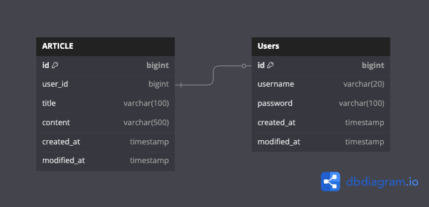

# hhplus-spring
항해플러스 사전 스터디 - Spring

# 개요
항해플러스 본 과정 진행 전 간단한게 SpringBoot에 대해 학습하고자 한다.

# 목표
- REST API 명세 작성하기
- ERD 작성하기
- 체계적으로 프로젝트 일정 관리하기
- CRUD 및 회원가입/로그인 기능 구현

# 유즈케이스

  

# API 명세
[API 명세 보러가기](https://jk0-8.gitbook.io/hhplus-spring/)

# ERD 

  

[ERD 보러 가기](https://dbdiagram.io/d/hhplus-spring-684cd8693cc77757c8d9b381)
